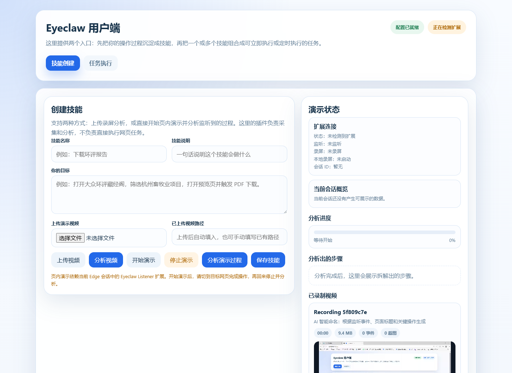
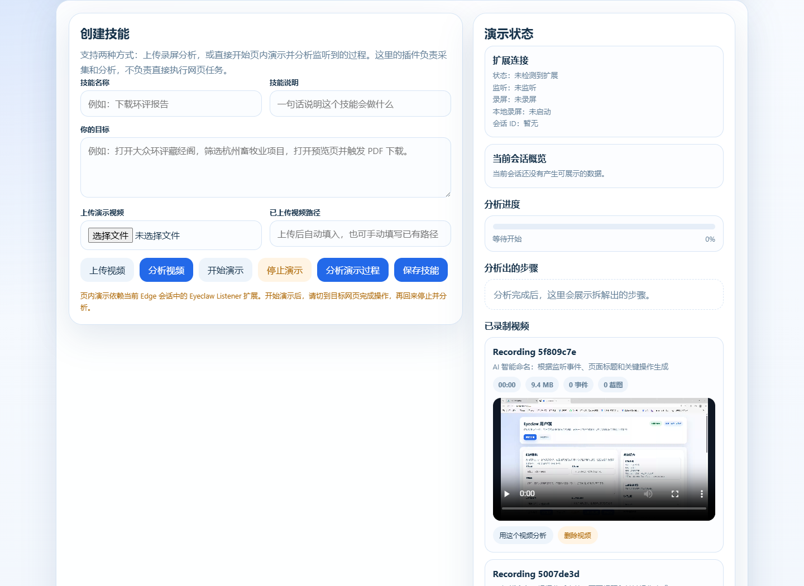
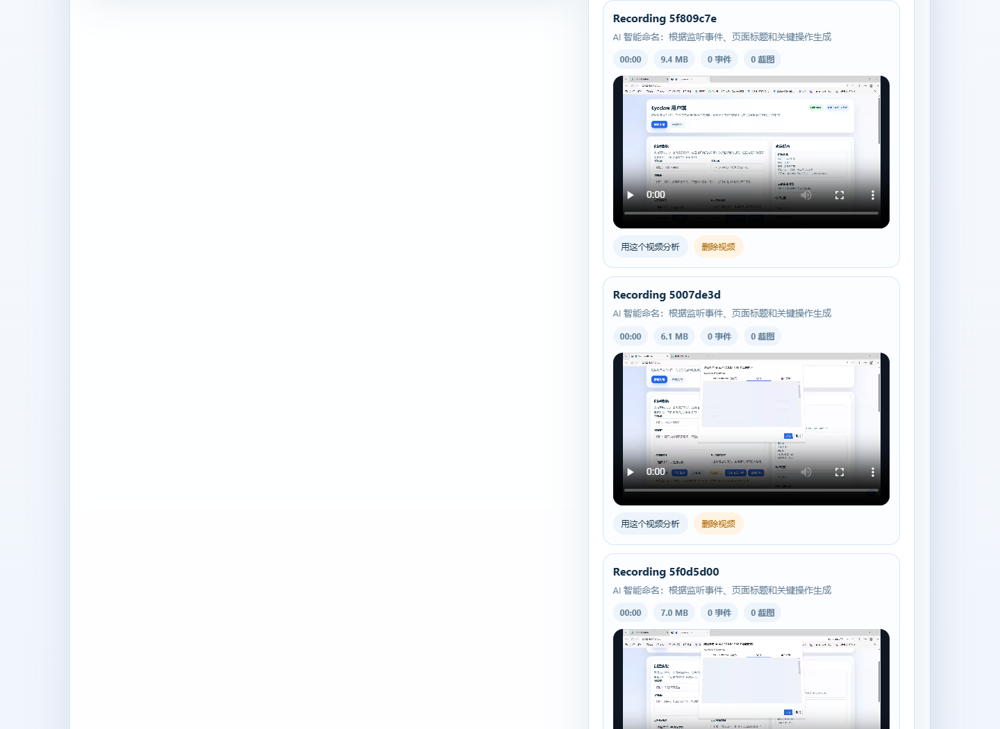
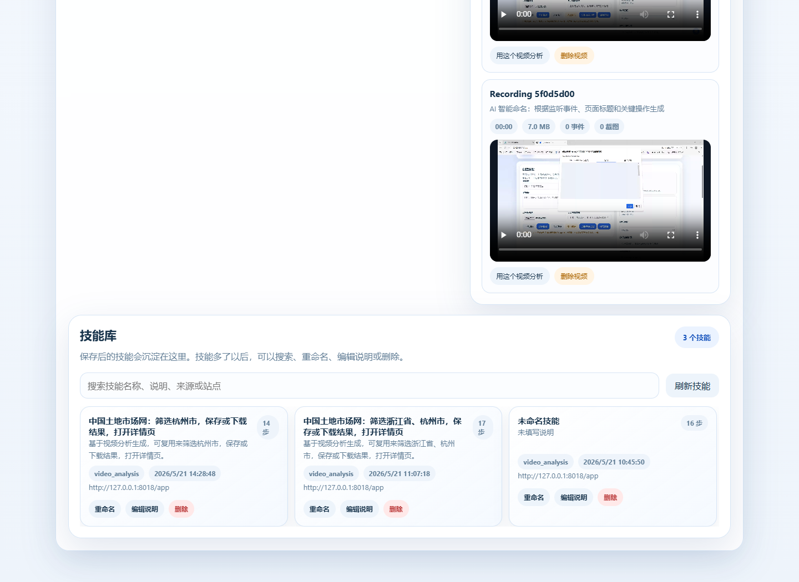
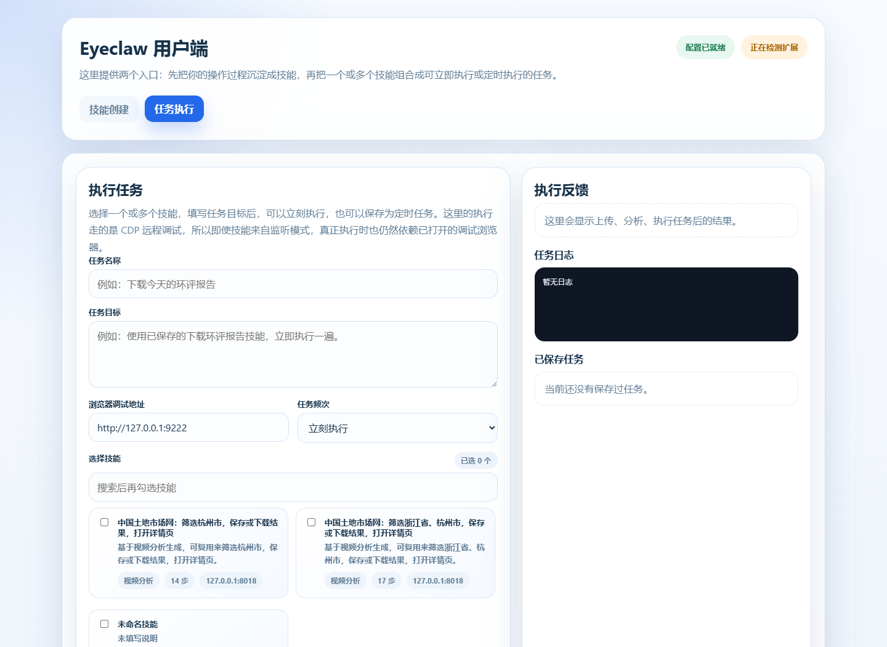

# EyeClaw 新手逐步教程

这份教程面向第一次使用 EyeClaw 的用户。你可以把它理解成一条完整闭环：

`打开控制台 -> 安装浏览器扩展 -> 开始监听和录屏 -> 手动演示一次流程 -> 分析生成步骤 -> 保存技能 -> 选择技能执行任务`

下面的截图来自当前本地前端界面。

## 1. 启动本地前端服务

先在项目根目录打开 PowerShell：

```powershell
cd C:\Users\majia\Documents\liangzhu
.venv\Scripts\python.exe -m uvicorn app_web:app --host 127.0.0.1 --port 8018
```

看到类似下面的信息，说明服务已经启动：

```text
Uvicorn running on http://127.0.0.1:8018
```

然后在 Edge 里打开：

```text
http://127.0.0.1:8018/app
```

打开后应该看到 EyeClaw 用户端控制台：



提示：`127.0.0.1` 表示“当前这台电脑本机”。如果软件装到另一台电脑上，那台电脑自己打开时通常仍然是这个地址。

## 2. 加载浏览器监听扩展

EyeClaw 需要浏览器扩展来监听点击、输入、滚动、页面跳转，并同步录屏。

手动加载方式：

1. 在 Edge 地址栏打开 `edge://extensions`。
2. 打开右侧或左侧的“开发人员模式”。
3. 点击“加载解压缩的扩展”。
4. 选择项目里的 `browser_listener_extension` 文件夹。
5. 回到 `http://127.0.0.1:8018/app`，看右上角扩展状态。

也可以用命令行拉起专用 Edge 配置：

```powershell
$edge='C:\Program Files (x86)\Microsoft\Edge\Application\msedge.exe'
$ext='C:\Users\majia\Documents\liangzhu\browser_listener_extension'
$profile='C:\Users\majia\Documents\liangzhu\.browser\listener-installed-profile'
Start-Process -FilePath $edge -ArgumentList "--user-data-dir=$profile","--disable-extensions-except=$ext","--load-extension=$ext","edge://extensions","http://127.0.0.1:8018/app"
```

注意：扩展不需要一直打开控制台才能生效。控制台主要用于查看状态、发起监听、分析和保存技能。

## 3. 创建一次演示任务

在“技能创建”页填写：

1. `技能名称`：例如“中国土地市场网：筛选杭州并保存结果”。
2. `技能说明`：一句话描述这个技能做什么。
3. `你的目标`：写清楚你准备演示的业务流程。

示例目标：

```text
打开中国土地市场网，进入土地供应-出让公告，筛选浙江省杭州市，选择土地用途，打开详情页并保存公告。
```

界面中的主要按钮如下：



按钮含义：

- `开始演示`：开始一次新会话，同时请求扩展开始监听和录屏。
- `停止演示`：结束监听和录屏，前端会刷新当前会话概览。
- `分析演示过程`：用监听时间轴和截图/录屏生成操作步骤。
- `保存技能`：把分析出的步骤保存成可复用技能。

## 4. 开始监听和录屏

点击 `开始演示` 后，按真实业务流程去目标网站里操作。

建议遵守这几个习惯：

- 只在普通网页上录制，不要停留在 `edge://extensions`、`edge://settings` 这类浏览器内部页面。
- 遇到扫码、验证码、登录确认时，手动完成即可，EyeClaw 会记录这是人工接管点。
- 操作不要太快，页面跳转、下拉菜单加载后再点下一步。
- 如果要筛选省市级联菜单，先展开上级，再点下级，例如先点“浙江省”，再点“杭州市”。

当前版本会自动过滤 EyeClaw 控制台相关事件，避免把“保存技能”“任务执行”这类控制台操作误当成目标网站步骤。

## 5. 停止演示并查看录屏

演示完成后，回到 EyeClaw 页面点击 `停止演示`。

如果录屏上传成功，会在“已录制视频”区域看到视频卡片。这里可以播放视频，也可以点击“用这个视频分析”。



如果这里没有视频，优先检查：

- 扩展是否显示已连接。
- 开始演示时是否允许了标签页录制。
- 当前页是不是普通网页，浏览器内部页不能录屏。
- 是否已经点击“停止演示”，录屏通常在停止后上传。

## 6. 分析演示过程

优先点击 `分析演示过程`，让系统按当前会话分析。

分析时 EyeClaw 会结合：

- 浏览器监听事件，例如点击、输入、滚动、页面跳转。
- 录屏时间轴。
- 监听器给出的关键时间点。
- 多模态模型对关键截图的理解。

这意味着抽帧不是平均抽帧，而是必须参考监听器时间轴。比如你点击“浙江省”“杭州市”的时间点，会影响关键帧选择和步骤生成。

分析完成后，右侧会显示“分析出的步骤”。你可以先快速检查：

- 起始网站是否正确。
- 是否混入 EyeClaw 控制台步骤。
- 省市、报告类型、按钮名称是否准确。
- 滚动步骤是否合理。

## 7. 保存技能

确认步骤基本正确后，点击 `保存技能`。

保存后的技能会出现在“已保存技能”区域。这里可以重命名、编辑说明、删除。



保存技能后，技能也会同步出现在“任务执行”页面的技能选择列表里。

## 8. 执行已保存技能

切换到顶部的 `任务执行` 标签页。



执行前需要准备一个带远程调试端口的 Edge。推荐用下面命令启动：

```powershell
$edge='C:\Program Files (x86)\Microsoft\Edge\Application\msedge.exe'
$profile='C:\Users\majia\Documents\liangzhu\.browser\edge-profile'
Start-Process -FilePath $edge -ArgumentList "--remote-debugging-port=9222","--user-data-dir=$profile","https://www.bing.com"
```

然后在任务执行页：

1. 填写 `任务名称`，例如“执行土地公告筛选”。
2. 填写 `任务目标`，说明这次要执行什么。
3. 确认 `浏览器调试地址` 是 `http://127.0.0.1:9222`。
4. 勾选一个或多个技能。
5. 点击执行。

当前版本在某一步失败时，不会立即判定整个任务失败。它会自动尝试其他方法：

- 重新观察当前页面。
- 换更宽松的定位策略。
- 过滤隐藏元素和控制台文本。
- 尝试滚动后点击。
- 尝试强制点击或 DOM 点击。
- 针对下拉框尝试候选项匹配。

如果仍然失败，右侧“任务日志”会显示失败原因。

## 9. 常见问题

### 9.1 网站打不开

先检查后端服务是否在运行：

```powershell
Invoke-WebRequest -UseBasicParsing http://127.0.0.1:8018/api/status
```

如果拒绝连接，重新启动：

```powershell
.venv\Scripts\python.exe -m uvicorn app_web:app --host 127.0.0.1 --port 8018
```

### 9.2 扩展显示未连接

检查：

- `edge://extensions` 里是否加载了 `browser_listener_extension`。
- 当前打开的是 `http://127.0.0.1:8018/app`。
- 扩展的 API 地址是否指向 `http://127.0.0.1:8018`。
- 刷新 EyeClaw 页面后再看右上角状态。

### 9.3 显示“当前页不能录屏”

浏览器安全策略不允许录制 `edge://`、`chrome://`、扩展页、设置页等内部页面。

解决方式：切到普通网页，例如目标业务网站，再点击开始演示或重新尝试录屏。

### 9.4 分析出来的步骤不准

优先检查：

- 演示时是否在目标网页完成了完整流程。
- 是否太快点击导致截图没捕捉到菜单展开状态。
- 目标网站是否有异步加载或滚动虚拟列表。
- 技能保存前是否人工检查了步骤。

当前系统已经会过滤 EyeClaw 控制台噪声，但目标网站内部的复杂菜单仍可能需要多演示几次来获得更稳定样本。

### 9.5 执行任务失败

常见原因：

- 起始网页和技能记录时差异太大。
- 网站内容、按钮文案、列表顺序变化。
- 需要人工登录、扫码或验证码。
- 下拉菜单没有展开，导致子项不可见。
- 滚动位置不同，目标元素尚未进入可点击区域。

当前版本会自动尝试恢复，但如果页面状态完全不同，仍需要你手动调整起始页面或重新录制技能。

## 10. 推荐使用习惯

- 每个技能只录一个清晰目标，不要把多个业务流程混在一次演示里。
- 演示前先想好目标网站和目标结果。
- 点击和滚动稍微慢一点，给监听器和截图留下稳定状态。
- 保存技能前先看一遍步骤。
- 第一次执行技能时，最好开着目标浏览器看它怎么跑。
- 如果执行成功率低，优先重新录一遍更干净的演示。
